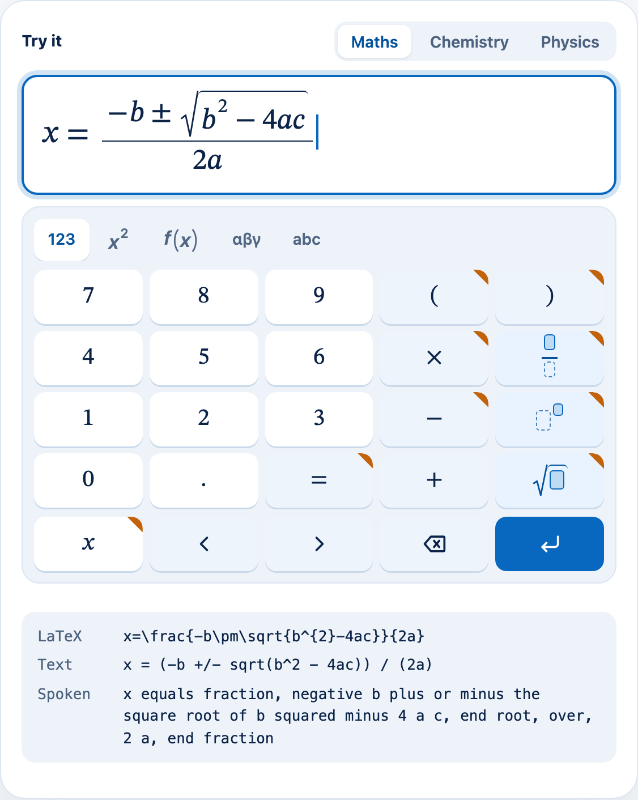
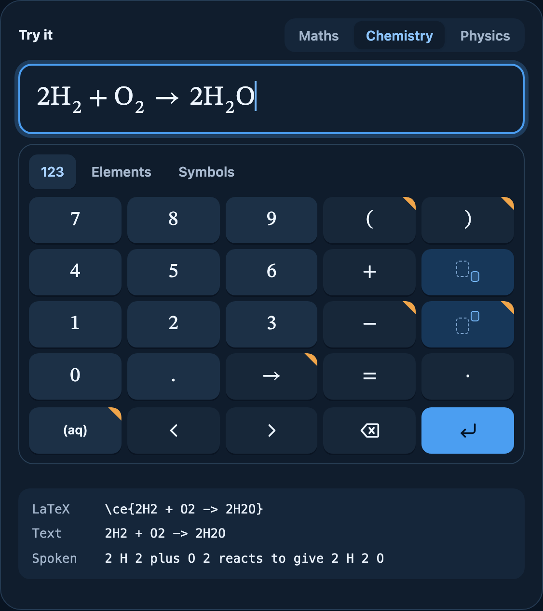

# MathInput

A keypad-first web component for entering maths, chemistry and physics
expressions the way they look on paper — no LaTeX, `^` or `sqrt()` to
learn. It returns each expression as a lossless tree plus LaTeX, linear
text, spoken text and MathML, ready to store, render, read aloud or pass to
other software.

Works on phones, tablets and desktops. Framework-agnostic (`<math-input>`
custom element) with a React wrapper. The keypad offers every key for the
subject by default; trim it to a course with topic tags, or use an optional
curriculum preset such as `@mathinput/presets-uk`.

<table>
  <tr>
    <td width="50%"></td>
    <td width="50%"></td>
  </tr>
  <tr>
    <td align="center">Maths, light mode</td>
    <td align="center">Chemistry, dark mode</td>
  </tr>
</table>

Try it live at [mathinput.rztaylor.uk](https://mathinput.rztaylor.uk).

> Status: **0.1.0, published on npm.** Pre-1.0, so a minor version may
> change the API; every change is listed in the [changelog](CHANGELOG.md),
> along with known limitations (manual real-device and screen-reader
> checks are still outstanding). The contract is the
> [component spec](docs/dev/specs/mathinput-component.md).

## Packages

| Package | Purpose |
|---|---|
| [`@mathinput/core`](https://www.npmjs.com/package/@mathinput/core) | Expression tree, headless editor, serialisers and parsers. No DOM. |
| [`@mathinput/element`](https://www.npmjs.com/package/@mathinput/element) | The `<math-input>` custom element, keypad and default styles. |
| [`@mathinput/react`](https://www.npmjs.com/package/@mathinput/react) | React wrapper. |
| [`@mathinput/presets-uk`](https://www.npmjs.com/package/@mathinput/presets-uk) | Optional UK curriculum keypads (GCSE Foundation, GCSE Higher, A-level). |

All four are published on npm under the `@mathinput` scope and released
together at the same version.

## Quick start

```bash
npm install @mathinput/element
npm install @mathinput/react   # React apps also
```

```html
<script type="module">
  import "@mathinput/element/define";
  import "@mathinput/element/mathinput.css";
</script>

<math-input subject="maths" label="Equation" submit-on-enter></math-input>

<script type="module">
  const el = document.querySelector("math-input");
  el.addEventListener("submit", (e) => console.log(e.detail.latex, e.detail.text));
</script>
```

React:

```tsx
import { MathInput } from "@mathinput/react";
import "@mathinput/element/mathinput.css";

<MathInput subject="chemistry" label="Equation" submitOnEnter onSubmit={(v) => save(v.doc)} />
```

Guides: [theming](docs/user/theming.md) · [keypad configuration](docs/user/keypad-config.md) · [output formats](docs/user/formats.md).

## Development

Requires Node 22 or later.

```bash
npm install
npm run check         # lint, typecheck, unit tests, build
npm run test:browser  # Playwright: rendering, keypad, axe (Chromium)
npm run dev           # demo playground
npm run screenshots   # regenerate the README images (after npm run build:site)
```

Repository conventions for contributors and agents are in
[AGENTS.md](AGENTS.md) and `.agents/facts/`.

## About

MathInput started inside a study app for GCSE students in England, who
needed to write maths, chemistry and physics answers on their phones. The
editors available expected an input language, were built around a desktop
keyboard, or did not handle chemistry, so this one was built keypad-first.

Nothing about the result turned out to be specific to students or to one
app, so it became a general-purpose component: it knows notation, not
curricula. Its roots survive in the GCSE and A-level notation it is tested
against, and in the optional `@mathinput/presets-uk` keypads.

## Licence

MIT
